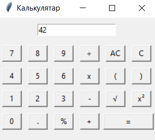

## Voiced calculator 🧮🔊

Simple calculator with voiced commands.

### Description

Based on [hiamandeep/tkcalc](https://github.com/hiamandeep/tkcalc) repository.

Written in python using `tkinter` and `winsound` standard libraries.

Calculator voices each arithmetic operation, input digit and result of calculations.

### How to run
* Download the code

* Put your own voice `.wav` files under `voice` folder. 
  1 file per 1 command / digit 
  e.g.: 0.wav 1.wav, 2.wav, ..., multiply.wav, calculate.wav

* Calculator is voiced with belarusian language. 
  In order to use it for other language you will also have to change filenames that are used in `calculator.py`.

### Known issues:
* `eval` is used instead of implementing own 
  [Reverse Polish Notation](https://en.wikipedia.org/wiki/Reverse_Polish_notation) 
  Yes, you can inject your own malicious code 👨‍💻🐱‍💻👩‍💻

* For simplicity with using `eval`, interger division is implemented instead of calculating percent (% operation)

* If result of floating point operation is integer, it is still displayed as float (e.g. 42.0)

* Layout is small and not beautiful. it was designed to be as simple and as fast to develop as possible :)
